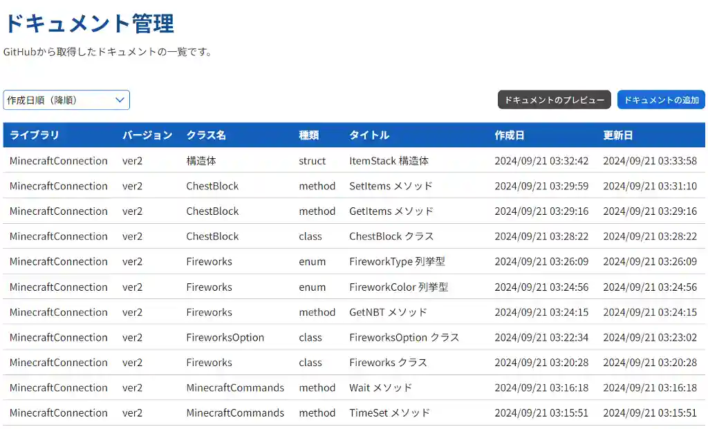
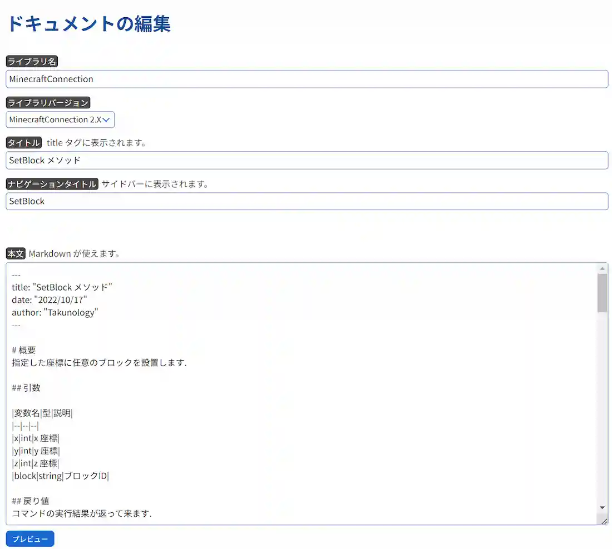
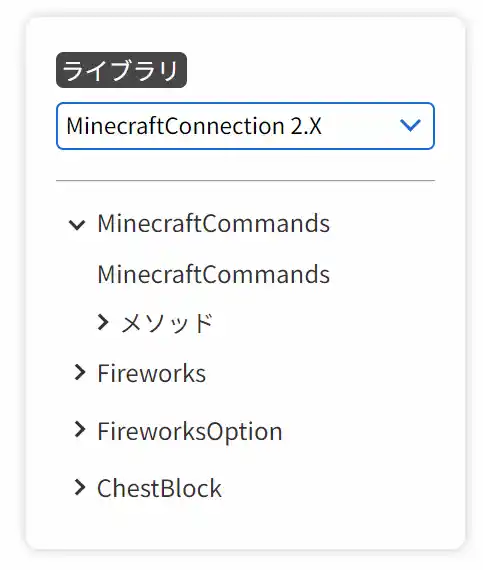
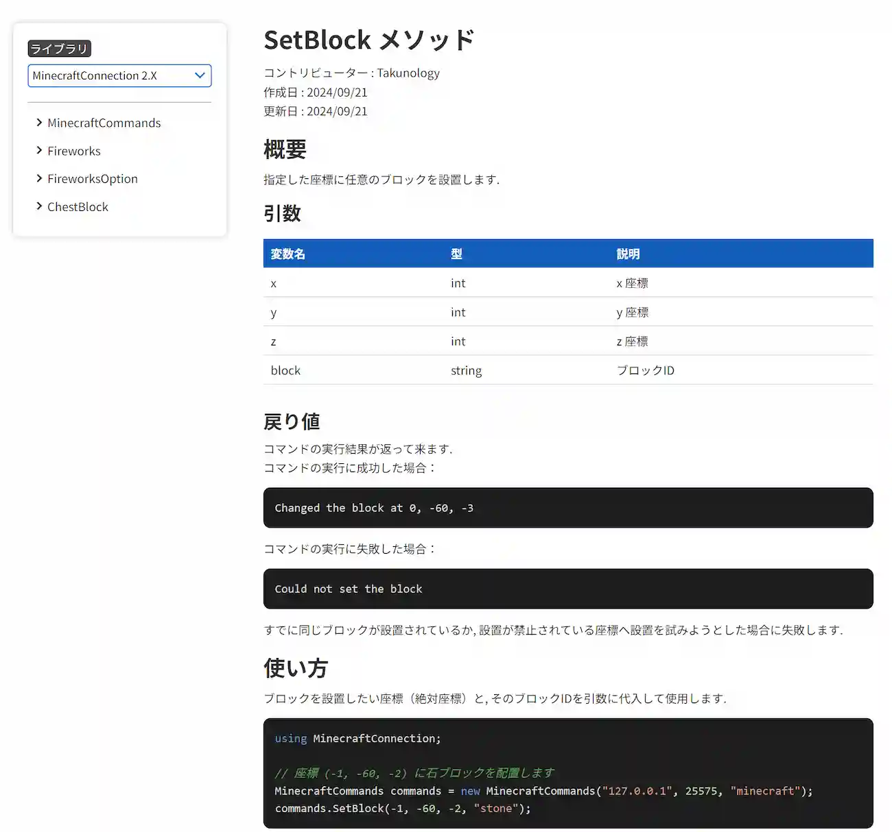
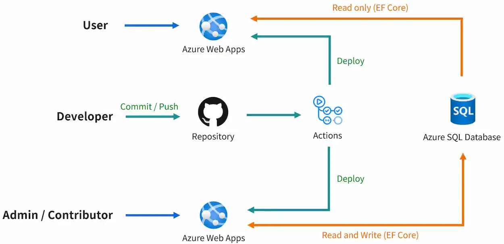

# 管理用ページと閲覧用ページのお話

今みなさんが見ている mcwithcode のサイト、実は閲覧用のサイトでして、ここからブログ記事やドキュメントなどを追加することはできません。今回はちょっとした Web サイトの仕組みを紹介しようと思います。

# 権限の分離
管理者用と閲覧用でわけているのはリスク回避です。本当は1つにまとめたほうが実装も楽ですし、1つのサーバで管理できるので便利ではあります。コストも半分で済みます。しかし、ページにログインフォームを設けて、管理者用ページへの導線があると、仮に突破されたときにデータを守れない可能性が出てきます。

そこで、以下のようにしました。

- 異なるリンク・サーバで管理する
- 閲覧用ページにログインフォームを設けない

私自身、セキュリティ対策への知識が怪しいところがあるので根本から分離してしまうことで、ある程度のリスクは回避できると思います。

データベースは共通して管理しているため、管理ページで反映した内容はそのまま閲覧ページに反映される仕組みになっています。

# 管理用ページでできること
これは裏側の話になりますね。基本的にできる操作は以下のとおりです。

- ニュース記事の管理
- 学習リソースの管理
- ブログ記事の管理
- ドキュメントの管理
- よくある質問の管理

このブログやドキュメントなどは Markdown で書かれており、その資料をデータベース上で管理しています。

このように入力された内容が HTML に変換されて閲覧ページに表示されるようになっています。

どのように変換してクエリしているかについては、またの機会に書きます～

# 閲覧ページへの反映
管理ページで追加された資料はデータベースから取得して反映させています。例えば、ドキュメントについては記事の種類に応じてサイドメニューの項目を自動で生成しています。

例えば画像2枚目のような記事を、閲覧ページで見るとこのように見えるわけです。

 

ということで、このWebサイトは2つに分かれており、1つのデータベースを共有しています。画像では Entity Framework Core を使用していること、GitHub Actions を使用して自動デプロイしていることなども書かれていますが、この辺についても別の記事にまとめようと思います。

 

以前みたいにいちいちコードを書き換える必要はなく、記事を管理できるようになったことでだいぶ便利になりました。